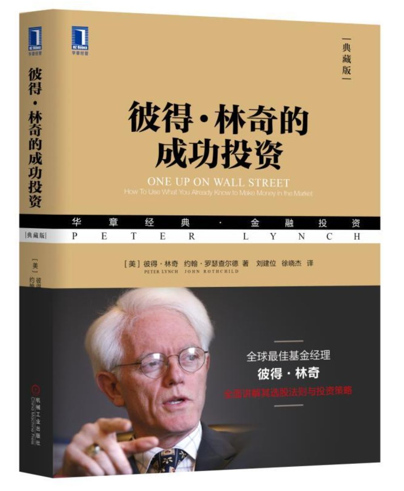

我们在投资理财过程中遇到的问题，大部分已经有了答案。我们要做的就是找到这些答案。而读书，就是最好的方式。于是整理了E大曾经推荐的书，形成了下面的书单。

01

**《巴菲特与索罗斯的投资习惯》**

​																					作者：马克·泰尔

​																					推荐指数：★★★★☆

02

**《邻家的百万富翁》**

​																		     作者：托马斯·斯坦利

​																			 推荐指数：★★★★★

03

**《漫步华尔街》**

​																		     作者：伯顿 G.马尔基尔

​																			 推荐指数：★★★★☆

04

**《股市长线法宝》**

​																		             作者：西格尔

​																					 推荐指数：★★★★☆

05

**《投资者的未来》**

​																				 作者：西格尔

​																				 推荐指数：★★★★★

06

**《彼得·林奇的成功投资》**

​																		          作者：彼得·林奇

​																				 推荐指数：★★★★★

07

**《笑傲股市》**

​																	        	作者：威廉·欧奈尔

​																				推荐指数：★★★★☆

08

**《投资心理学》**

​																			作者：约翰 R.诺夫辛格

​																			推荐指数：★★★★★

09

**《战胜华尔街》**

​																				作者：彼得·林奇	

​																				推荐指数：★★★★☆

10

**《聪明的投资者》**

​																		     作者：本杰明·格雷厄姆

​																			推荐指数：★★★★★

11

**《投资学》**

​																		       作者：滋维·博迪

​																			   推荐指数：★★★★☆

12

**《滚雪球》**

​																		      作者：艾丽斯·施罗德 

​																			 推荐指数：★★★★☆

13

**《非理性繁荣》**

​																		     作者：罗伯特.J.希勒

​																		     推荐指数：★★★☆☆

14

**《金融的逻辑》**

​																		      作者：陈志武

​																			 推荐指数：★★★★☆

15

**《约翰聂夫的成功投资》**

​																		       作者：约翰聂夫

​																			   推荐指数：★★★☆☆

   															

16

**《黑天鹅》**

​																		作者：纳西姆.尼古拉斯.塔勒布

​																		推荐指数：★★★★☆

17

**《反脆弱》**

​																		作者：纳西姆.尼古拉斯.塔勒布

​																		推荐指数：★★★★☆

------

