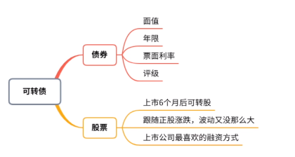

**什么是可转债**

票面价值：100元
到期本息110元左右，具体的债具体看条款

从历史数据来看，可转债到期还本付息的很少
对于长期处于130元以上的可转债，要注意是否在转股期，是否有强制赎回的风险

**为什么玩可转债：容易赚，不易亏**

债券-到期偿还票面金额+约定利息

正股涨-可转债跟着涨

正股跌-下调转股价，可转债同样会涨

下有保底-回售条款

* 不需要本金

* 操作简单

* 收益高

* 风险小

  

**可转债打表示**

* 你愿意把钱借给发债公司

* 发债公司到期要还本付息->可转债必然消失的（到期）

* 每张债券，代表本金100元

  

**转股**

必须在转股期内，多为发行半年左右

从债券转成股票 
面值/转股价=可转成的股票数量（100元/14.76 = 6.7股）

一张可转债背后的价值
股数x股票现价 = 转债价值 （6.7股x14.96 = 100.232元）

股票价格上涨->转债背后代表的股票价格上涨
有观点认为，可转债是：普通债权+看涨期权

**赎回**
* 强制赎回
  在本次发行的可转债转股期内，如果公司股票连续三十个交易日中至少有十五个交易的收盘价不低于当期转股价格的130%(含130%)

* 有条件赎回
  规模不足3000万，转股转没了；强制赎回

* 到期还钱

  

**可转债打新的主要风险**
* 还本付息利息率很低

* 不能及时卖出盈利

* 公司破产，还不起债（机率小）

  

**如何参与打新**
* 信用申购（有账户就行，不需要市值）
* 上海基金户可以交易可转债，深圳的不可以
*  配售（有该公司的股票，享受配售权利）

**提高可转债的中签率**

* 可以顶格申购

* 1000个配号，1000次中签机会

* 一个人打一次（多个股票账户 同一张身份证没必要都申购）

  

**有用的网站**

打新建议：公众号（跟投club）

可转债基本信息：[东财](http://data.eastmoney.com/kzz/default.html)

评级、到期收益率、剩余年限、下调转股价历史：[集思录](https://www.jisilu.cn/data/cbnew/#cb)

老钱：[可转债一方搞懂](https://mp.weixin.qq.com/s/jy4hLOw1GyJ0rIfRcoj3KQ)

**华宝智投APP**

* 申购

交易->可转债专区->可转债申购->申购。[申购操作](https://www.bilibili.com/s/video/BV1LZ4y1x7ku) 

* 预约申购

交易->新股/新债申购。[预约申购操作](https://www.bilibili.com/video/BV1nE411x7FT?from=search&seid=10929540039416760674)

* 卖出

上市当天卖出